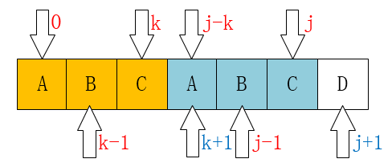

#  **深入理解KMP算法**
##  <font color=#FF4500> **Part I 背景知识**</font>
> 在本人所描述的代码中，String1是一个结构体，其定义是：
```cpp
typedef struct
{
  String P;
  int length;
} String1;
```
> 包含了一个字符串与其对应的长度，目的是仿真Java中的String类。

> KMP算法要求求出目标字符串在与给定字符串不匹配时应该回退到的位置，即求出next[i]数组，并用其简化对应的匹配过程。

---

##  <font color=#FF4500> **Part II 求next[j]数组** </font>


> 直接给出求next[i]的代码进行分析：

> 这个是回退的基本原则，也是理解下面代码的基础。

> P[0~k-1]==P[j-k~j-1];


> 当P[j]不能与目标串相匹配的时候，下一步让谁来匹配呢?自然让第一个字母就开始保证与之前的匹配啦。

> 所以P[0~k-1]==P[j-k~j-1]一定是成立的！


```java
//求next[i]数组的值：
 public static int[] getNext(String ps)
{
  char[] p = ps.toCharArray();
  int[] next = new int[p.length];
  next[0] = -1;
  //把String中的0号位置初始化为-1，为什么？
  //其目的是为了如果某位置一直回退到了墙边，那它就退无可退
  //所以初始化next[0]=-1;
  int j = 0;
  int k = -1;
  while (j < p.length - 1)
  {
    //遍历每一个j，分别求出next[j]的值
    if (k == -1 || p[j] == p[k]) 
    {
```
> 在这里，我要说明一件事,对下面代码的判断：


> 如果出现了同样的重复节点，后面的不匹配了，那么前面的就不会匹配了，把next[k]的值赋值给他，让他再往前面跳。
```java
        if (p[++j] == p[++k]) 
        { 
          next[j] = next[k];// 当两个字符相等时要跳过
        } 
      //说明一下p[j] == p[k]的情况
```


图片3



图片4
```java
      //由这两幅图可以看出
      //next[j+1] == k + 1 == next[j] + 1    
      //(k==next[j])
      //在这里也要起到将j后移的作用（上面k已经后移了）
      next[++j] = k;
    } 
    else if(p[k]!=p[j])
    {
      //前面的已经匹配上了吧，但是哈：
      //这里可不行啦，
      //前面的匹配上了，后面又不能匹配上
      k = next[k];
      //这里懂得都懂哈
      //j的值是没有被改变的，我们要确定下一次回退的位置
      //所以回退k，进行下一步的循环之后，再次进行判断
      //如果p[k]==p[j]，那我们就找到了
      //如果还是不对，那我们就再回退
      //如果我们回到了墙边，那就赋值为0
      //并且j++，进行下一步的操作。
          
    } 
  }
  return next;//最后将生成的next数组
}
 ```
 ##  <font color=#FF4500> **Part III KMP算法** </font>

> 求得next[j]之后一切都变得简单起来。

> 故直接将KMP(快速模式匹配算法)的代码给出，如下：

```java
public static int KMP(String ts, String ps) 
{
    char[] t = ts.toCharArray();
    char[] p = ps.toCharArray();
    int i = 0; // 主串的位置
    int j = 0; // 模式串的位置
    int[] next = getNext(ps);
    while (i < t.length && j < p.length) 
    {
       if (j == -1 || t[i] == p[j]) 
       { // 当j为-1时，要移动的是i，当然j也要归0
           i++;
           j++;
       } 
       else 
       {
           // i不需要回溯了
           // i = i - j + 1;
           j = next[j]; // j回到指定位置
       }
    }
    if (j == p.length) 
    {
       return i - j;
       //此时的i在末尾哈，自然要减去长度
    } 
    else 
    {
       return -1;
    }
}