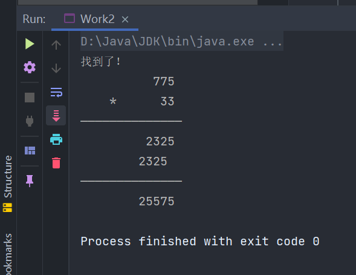

# 期末作业 ———李晓阳2021091203006
## 民意调查
### 题干：
> 为了解人们获取新闻的来源，调查小组对N个人进行了民意调查，其结果如下：
> 50人使用电视作为新闻来源，其中包括只看电视的和结合其他新闻来源的人；
> 61人不适用收音机作为新闻来源；
> 13人不适用报纸作为新闻来源；
> 74人至少使用两种方式来获取新闻。
> 求N的最大值和最小值。
### 算法：
 

> N=a+b+c+d+e+f+g+h;  
> a+b+d+e==50  
> a+d+g+h==61;  
> a+b+c+h==13;  
> b+d+e+f==74;  
> 首先，所有的数据至少为1  
> d+e==50-a-b;(这是e的条件)  
> g+h+d==61-a;(这是h的条件)  
> e+f==74-b-d;(这是f的条件)  
> c+h==13-a-b;(这是h的条件)  
> a,b,c,h:1-10  
> e:19-47  
> d:1-59  
> f:1-71  
> g:1-59  
### 代码：
```java
public class Work1 {
    public static void main(String[] args) {
        int N, a = 0, b = 0, c = 0, d = 0, e = 0, f = 0, g = 0, h = 0;
        int MAXRETURN = 0;
        int MINRETURN = 65535;
        // N=a+b+c+d+e+f+g+h;
        // a+b+d+e==50;
        // a+d+g+h==61;
        // a+b+c+h==13;
        // b+d+e+f==74;
        //a,b,c,h的范围是13；d，e的范围是50；g,f的范围是61
        for (a = 1; a > 0 && a <= 10; ++a)
            for (b = 1; b > 0 && b <= 10; ++b)
                for (c = 1; c > 0 && c <= 10; ++c)
                    for (d = 1; d > 0 && d <= 47; ++d)
                        for (e = 50 - a - b - d; e > 0 && e <= 47 && d + e == 50 - a - b; ++e)
                            for (f = 74 - b - d - e; f > 0 && f <= 71 && e + f == 74 - b - d; ++f)
                                for (g = 1; g > 0 && g <= 58; ++g)
                                    for (h = 13 - a - b - c; h > 0 && h <= 10 && c + h == 13 - a - b; ++h) {
                                        if (a + b + d + e == 50 && a + d + g + h == 61 && a + b + c + h == 13 && b + d + e + f == 74) {
                                            int temp = a + b + c + d + e + f + g + h;
//                                            System.out.println("[" + a + "," + b + "," + c + "," + d + "," + e + "," + f + "," + g + "," + h + "]");
//                                            System.out.println();
                                            if (temp > MAXRETURN) {
                                                MAXRETURN = temp;
                                            }
                                            else if (temp < MINRETURN) {
                                                MINRETURN = temp;
                                            }
                                        }
                                    }
        System.out.println(MAXRETURN+","+MINRETURN);


    }
}
```
### 结果：
 

### 小结：
> 这个题做得时候想直接暴力破解，结果发现时间超时太严重  
> 所以就暴力，加了几个限制的条件就可以啦。
---
## 还原竖式
### 题干：
>下图的乘法竖式中，每一个星号代表一个数位。若出现的数字有且仅有2,3,5,7四种，
> 能将此竖式完全还原吗？<br>
> 进一步，若将题目中的2，3，5，7改为其它互异的四个数字，还存在要求的乘法竖式吗？<br>
> 进一步，若将题目中的2，3 ，5，7改为其它互异的多个(2~10)数字，还存在要求的乘法竖式吗？<br>
### 算法：
> 分为几个函数，下面分别进行介绍：<br>

> public static void getAllOne(HashMap<Integer, int[]> ret) --> getAllTen
>  这个函数的功能是得到所有n位互异整数,并以HashMap的形式进行返回。

> public static boolean judgeDigits(int temp, int toJudge) <br>
> 这个函数的功能是判断数字的位数是不是符合我们的要求。

> public static boolean judgeRange(int temp)<br>
> 这个函数的功能是判断所有组成数字是不是符合我们的要求（是不是在range数组之中）。

> public static void printRet(int one, int two, int three, int four, int five) <br>
> 这个函数的功能是针对本题进行整齐的输出。

> public static void judgeCompletePartOne(int num, boolean[] basket) <br>
> 根据所有数字初始化basket桶,目的是检查是不是完全覆盖了目标数组

> public static boolean judgeCompletePartTwo(boolean[] basket, int[] work) <br>
> 根据目标数组和上一函数得到的桶，返回是否完全覆盖了目标数组

> 主函数 <br>
> 思想就是遍历，并相应的，满足条件时输出即可。
### 代码：
```java
    static HashMap<Integer, int[]> work = new HashMap<>();


    public static void getAllTwo(HashMap<Integer, int[]> ret) {
        int cnt = 0;
        for (int i = 0; i < 10; ++i) {//1
            for (int j = i + 1; j < 10; ++j) {//10
                if (i != j) {
                    cnt++;
                    int[] a = new int[]{i, j};
                    ret.put(cnt, a);
                }
            }
        }
    }

    public static void getAllThree(HashMap<Integer, int[]> ret) {
        int cnt = 0;
        for (int i = 0; i < 10; ++i) {//1
            for (int j = i + 1; j < 10; ++j) {//10
                for (int k = j + 1; k < 10; ++k) {//100
                    if (i != j && i != k && j != k) {
                        cnt++;
                        int[] a = new int[]{i, j, k};
                        ret.put(cnt, a);
                    }

                }
            }
        }
    }

    //得到所有的互异的四个元素的数组
    public static void getAllFour(HashMap<Integer, int[]> ret) {
        int cnt = 0;
        for (int i = 0; i < 10; ++i) {//1
            for (int j = i + 1; j < 10; ++j) {//10
                for (int k = j + 1; k < 10; ++k) {//100
                    for (int l = k + 1; l < 10; ++l) {//1000
                        if (i != j && i != k && i != l && j != k && j != l && k != l) {
                            cnt++;
                            int[] a = new int[]{i, j, k, l};
                            ret.put(cnt, a);
                        }
                    }
                }
            }
        }
    }

    public static void getAllFive(HashMap<Integer, int[]> ret) {
        int cnt = 0;
        for (int i = 0; i < 10; ++i) {//1
            for (int j = i + 1; j < 10; ++j) {//10
                for (int k = j + 1; k < 10; ++k) {//100
                    for (int l = k + 1; l < 10; ++l) {//1000
                        for (int m = l + 1; m < 10; ++m) {//10000
                            if (i != j && i != k && i != l && j != k && j != l &&
                                    k != l && m != i && m != j && m != k && m != l) {
                                cnt++;
                                int[] a = new int[]{i, j, k, l, m};
                                ret.put(cnt, a);
                            }
                        }
                    }
                }
            }
        }
    }

    public static void getAllSix(HashMap<Integer, int[]> ret) {
        int cnt = 0;
        for (int i = 0; i < 10; ++i) {//1
            for (int j = i + 1; j < 10; ++j) {//10
                for (int k = j + 1; k < 10; ++k) {//100
                    for (int l = k + 1; l < 10; ++l) {//1000
                        for (int m = l + 1; m < 10; ++m) {//10000
                            for (int n = m + 1; n < 10; ++n) {
                                if (i != j && i != k && i != l && j != k && j != l &&
                                        k != l && m != i && m != j && m != k && m != l
                                        && n != i && n != j && n != k && n != l && n != m) {
                                    cnt++;
                                    int[] a = new int[]{i, j, k, l, m, n};
                                    ret.put(cnt, a);
                                }
                            }
                        }
                    }
                }
            }
        }
    }

    public static void getAllSeven(HashMap<Integer, int[]> ret) {
        int cnt = 0;
        for (int i = 0; i < 10; ++i) {//1
            for (int j = i + 1; j < 10; ++j) {//10
                for (int k = j + 1; k < 10; ++k) {//100
                    for (int l = k + 1; l < 10; ++l) {//1000
                        for (int m = l + 1; m < 10; ++m) {//10000
                            for (int n = m + 1; n < 10; ++n) {
                                for (int o = n + 1; o < 10; ++o) {
                                    if (i != j && i != k && i != l && j != k && j != l &&
                                            k != l && m != i && m != j && m != k && m != l
                                            && n != i && n != j && n != k && n != l && n != m
                                            && o != i && o != j && o != k && o != l && o != m && o != n) {
                                        cnt++;
                                        int[] a = new int[]{i, j, k, l, m, n, o};
                                        ret.put(cnt, a);
                                    }
                                }
                            }
                        }
                    }
                }
            }
        }
    }

    public static void getAllEight(HashMap<Integer, int[]> ret) {
        int cnt = 0;
        for (int i = 0; i < 10; ++i) {//1
            for (int j = i + 1; j < 10; ++j) {//10
                for (int k = j + 1; k < 10; ++k) {//100
                    for (int l = k + 1; l < 10; ++l) {//1000
                        for (int m = l + 1; m < 10; ++m) {//10000
                            for (int n = m + 1; n < 10; ++n) {
                                for (int o = n + 1; o < 10; ++o) {
                                    for (int q = o + 1; q < 10; ++q) {
                                        if (i != j && i != k && i != l && j != k && j != l &&
                                                k != l && m != i && m != j && m != k && m != l
                                                && n != i && n != j && n != k && n != l && n != m
                                                && o != i && o != j && o != k && o != l && o != m && o != n
                                                && q != i && q != j && q != k && q != l && q != m && q != n && q != o) {
                                            cnt++;
                                            int[] a = new int[]{i, j, k, l, m, n, o, q};
                                            ret.put(cnt, a);
                                        }
                                    }
                                }
                            }
                        }
                    }
                }
            }
        }
    }

    public static void getAllNine(HashMap<Integer, int[]> ret) {
        int cnt = 0;
        for (int i = 0; i < 10; ++i) {//1
            for (int j = i + 1; j < 10; ++j) {//10
                for (int k = j + 1; k < 10; ++k) {//100
                    for (int l = k + 1; l < 10; ++l) {//1000
                        for (int m = l + 1; m < 10; ++m) {//10000
                            for (int n = m + 1; n < 10; ++n) {
                                for (int o = n + 1; o < 10; ++o) {
                                    for (int q = o + 1; q < 10; ++q) {
                                        for (int r = q + 1; r < 10; ++r) {
                                            if (i != j && i != k && i != l && j != k && j != l &&
                                                    k != l && m != i && m != j && m != k && m != l
                                                    && n != i && n != j && n != k && n != l && n != m
                                                    && o != i && o != j && o != k && o != l && o != m && o != n
                                                    && q != i && q != j && q != k && q != l && q != m && q != n && q != o
                                                    && r != i && r != j && r != k && r != l && r != m && r != n && r != o && r != q) {
                                                cnt++;
                                                int[] a = new int[]{i, j, k, l, m, n, o, q, r};
                                                ret.put(cnt, a);
                                            }
                                        }
                                    }
                                }
                            }
                        }
                    }
                }
            }
        }
    }

    public static void getAllTen(HashMap<Integer, int[]> ret) {
        int[] workTemp = new int[]{0, 1, 2, 3, 4, 5, 6, 7, 8, 9};
        ret.put(1, workTemp);
    }


    //判断数字的位数是不是符合要求
    public static boolean judgeDigits(int temp, int toJudge) {
        if (temp == 0 && toJudge == 1) return true;
        int cnt = 0;
        while (temp != 0) {
            cnt++;
            temp = temp / 10;
        }
        return (cnt == toJudge);
    }

    //判断数字的各个组成是不是在range数组里面
    public static boolean judgeRange(int temp, int[] range) {
        while (temp != 0) {
            int work = temp % 10;
            int flag = 0;
            for (int a : range) {
                if (a == work) {
                    flag = 1;
                    break;
                }
            }
            if (flag == 0) {
                return false;
            }
            temp = temp / 10;
        }
        return true;
    }

    //根据所有数字初始化basket桶
    public static void judgeCompletePartOne(int num, boolean[] basket) {
        while (num != 0) {
            basket[num % 10] = true;
            num /= 10;
        }
    }

    //根据basket桶判断是不是覆盖了所有元素
    public static boolean judgeCompletePartTwo(boolean[] basket, int[] work) {
        for (int a : work) {
            if (!basket[a])
                return false;
        }
        return true;
    }


    public static void printRet(int one, int two, int three, int four, int five) {
        System.out.println("\t\t  " + one);
        System.out.println("*\t\t   " + two);
        System.out.println("——————————————");
        System.out.println("\t\t" + " " + three);
        System.out.println("\t\t" + four + " ");
        System.out.println("——————————————");
        System.out.println("\t\t" + five);
    }

    public static void main(String[] args) {
      //  getAllTwo(work);          ------0
      //  getAllThree(work);        ------3
      //  getAllFour(work);         ------23
      //  getAllFive(work);         ------336
      //  getAllSix(work);          ------1645
      //  getAllSeven(work);        ------4369
      //  getAllEight(work);        ------5889
      //  getAllNine(work);         ------2718
      //  getAllTen(work);          ------0
        boolean[] basket = new boolean[10];
        int cnt = 0;
        for (int i = 1; i <= work.size(); ++i) {
            int[] range = work.get(i);
//        int[] range = new int[]{9, 8, 7, 6};
            int one = 0;    //第一层：3
            int two = 0;    //第二层：2
            int three = 0;  //第三层：4
            int four = 0;   //第四层：4
            int five = 0;   //第五层：5
        /*
        条件是：
         one*(two%10)==three;
         one*(two/10)==four;
         one*two==five;
         three+four*10==five;
        */
            int p = 0;
            for (int a = 0; p < range.length && range[p] != 0; ++p) {
                a = range[p];
                for (int b : range) {
                    for (int c : range) {
                        one = 100 * a + 10 * b + c;
                        for (int d : range) {
                            for (int e : range) {
                                two = 10 * d + e;
                                {
                                    three = one * (two % 10);
                                    four = one * (two / 10);
                                    five = one * two;
                                    Arrays.fill(basket, false);
                                    judgeCompletePartOne(one, basket);
                                    judgeCompletePartOne(two, basket);
                                    judgeCompletePartOne(three, basket);
                                    judgeCompletePartOne(four, basket);
                                    judgeCompletePartOne(five, basket);

                                    if (((three + (four * 10)) == five) && judgeDigits(one, 3) && judgeDigits(two, 2)
                                            && judgeDigits(five, 5) && judgeDigits(four, 4) && judgeDigits(three, 4) &&
                                            judgeRange(three, range) && judgeRange(four, range) && judgeRange(five, range)
                                    ) {

                                        if (judgeCompletePartTwo(basket, range)) {
                                            cnt++;
                                            System.out.println("-------------------------");
                                            System.out.print(cnt + ":\t");

                                            System.out.println("找到了！");
                                            System.out.println(Arrays.toString(range));
                                            printRet(one, two, three, four, five);
                                        }
                                    }
                                }
                            }
                        }


                    }
                }
//            System.out.println("没有找到");
            }
        }
        if (cnt == 0) {
            System.out.println("没有找到！");
            return;
        }
        System.out.println("-------------------------");
        System.out.println("cnt==" + cnt);
    }

```
### 结果：



> 由计算可知，第二个小问答案是：有，并有23种可能。
> getAllTwo(work);          ------0   <br>
> getAllThree(work);        ------3   <br>
> getAllFour(work);         ------23    <br>
> getAllFive(work);         ------336   <br>
> getAllSix(work);          ------1645    <br>
> getAllSeven(work);        ------4369    <br>
> getAllEight(work);        ------5889    <br>
> getAllNine(work);         ------2718    <br>
> getAllTen(work);          ------0   <br>

### 小结：
> 这个题做的是历经非常多的波折,由于一开始没有注意后面的要求  
> 所以导致了许多的波折，一改再改  
> 首先是初始化了一个大体上的思路
> 然后解决了如何覆盖所有情况、如何判断是不是重复、如何利用桶排序等等  
> 最后留下了一个问题就是如何将多个函数的多种情况进行统一的描述，这里我没有征得特别清楚。  
> 这个题目提升了我的coding能力。

---
## 火力网问题
### 题干：
> 在一个n*n的网格里，每个网格可能为“墙壁”和“街道”。现在在街道放置碉堡，每个碉
> 堡可以向上下左右四个方向开火。子弹射程无限远，墙壁可以阻挡子弹。问最多能放置
> 多少个碉堡，使它们彼此不会互相摧毁。
> 假设黑正方形表示墙壁，空白正方形表示街道，圆球代表碉堡。图B的碉堡放置是正确的，
> 图C的碉堡放置是错误的。因为图C在某一行或者某一列有两个碉堡，这样他们就会互相攻击。
### 算法：
> 首先定义输入的格式，以W代表墙，以E代表空白处，让用户输入矩阵的大小。 <br>
> 介绍这些函数： <br>

> public static boolean coordinateCheck(int xToCheck, int yToCheck)  <br>
> 在我们每次插入新的火力的时候，需要保证这里可以被插入 <br>
> 检查的方式是如果这一行或者这一列如果有一个墙，由于深度优先搜索的遍历方式 <br>
> 所以检查的时候时就遇到墙就可以退出这个循环了 <br>
> 但是一旦遍历的时候遇到了occupyChar这个字符，就代表了这一行或者是这一列有了火力，直接退出循环，返回false <br>

> public static void DFS(int currentPosition, int temp) <br>
> 这个函数是一个标准算法，就是对于二维数组的深度优先遍历 <br>
> 传进去的参数是当前的位置，每次递归都会加一，所以通过除以长度和对长度取模就可以得到对应的位置了 <br>
> 如果这个位置是空的，就进行下一步调用上一函数进行检查，如果正确就进行遍历并标记 <br>
> 遍历退出的时候就可以让temp和当前的最大值ret进行比较取得最大值。<br>
> 如果当前的位置超出了整个数组的最大的范围的话，就可以退出函数了。<br>

> 主函数 <br>
> 思想简单，根据输入初始化的长度与对应的矩阵就可以及进行初始化。<br>
> 然后调用DFS从第一个位置上开始遍历就可以了。<br>
> 最终进行整齐的输出即可。 <br>


### 代码：
```java
import java.io.IOException;
import java.util.Scanner;

public class Work3 {
    private static final char wall = 'W';                               //墙位置的字符
    private static final char empty = 'E';                              //空白位置的字符
    private static final char occupyChar = '#';                         //标记占据过的位置
    private static int lengthOfArray;                                   //用户输入的大小
    private static int ret;                                             //最后返回的结果
    private static final int MAXSIZE = 150;                             //深度搜索得最大size
    private static final char[][] Map = new char[MAXSIZE][MAXSIZE];     //地图数组，用于深度搜索

    public static boolean coordinateCheck(int xToCheck, int yToCheck) {
        for (int i = xToCheck - 1; i >= 0; i--) {
            if (occupyChar == Map[i][yToCheck]) {
                return false;
            }else if (wall == Map[i][yToCheck]) {
                break;
            }
        }

        for (int j = yToCheck - 1; j >= 0; j--) {
            if (Map[xToCheck][j] == occupyChar) {
                return false;
            } else if (Map[xToCheck][j] == wall) {
                break;
            }

        }
        return true;
    }

    public static void DFS(int currentPosition, int temp) {
        int xCoordinate;
        int yCoordinate;
        if (currentPosition >= lengthOfArray * lengthOfArray) {
            ret = Math.max(ret, temp);
        } else if (currentPosition < lengthOfArray * lengthOfArray) {
            //得到该次递归的坐标
            xCoordinate = currentPosition / lengthOfArray;
            yCoordinate = currentPosition % lengthOfArray;
            if (empty == Map[xCoordinate][yCoordinate]) {
                if (coordinateCheck(xCoordinate, yCoordinate)) {
                    Map[xCoordinate][yCoordinate] = occupyChar;
                    DFS(currentPosition + 1, temp + 1);
                    Map[xCoordinate][yCoordinate] = empty;
                }else{
                    ;
                }
            }
            DFS(currentPosition + 1, temp);
        }

    }

    public static void main(String[] args) throws IOException {
        //读入整个数组的大小
        System.out.println("请输入整个数组的大小：");
        Scanner in = new Scanner(System.in);
        lengthOfArray = in.nextInt();
        //读入整个数组
        System.out.println("用W代表墙，用E代表空白，初始化一个" + lengthOfArray + "*" + lengthOfArray + "的数组：");
        for (int i = 0; i < lengthOfArray; ++i) {
            for (int j = 0; j < lengthOfArray; ++j) {
                Map[i][j] = (char) System.in.read();
            }
        }
        DFS(0, 0);
        System.out.println("根据深度优先搜索，得到的最大的可以放置的火力的个数是：" + ret);
    }

}
```
### 结果：


### 小结：
> 由于之前我已经比较熟悉DFS算法使用递归算法的实现  
> 我也实现了n皇后问题，这导致我感觉这是最简单的一道题目  
> 主要的困难是在不符合条件的时候回溯的过程以及最大值的得到过程  
> 基本完美的实现了这个题目所要求的功能。